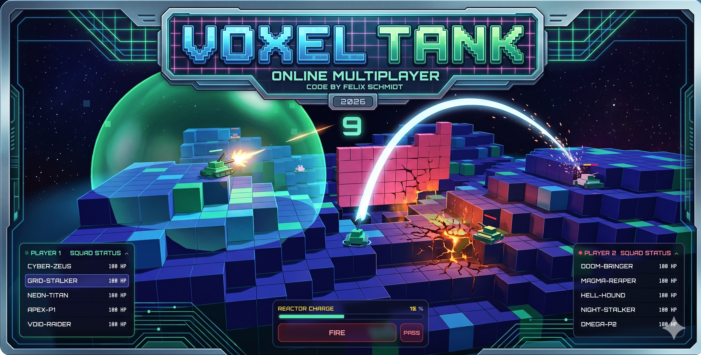
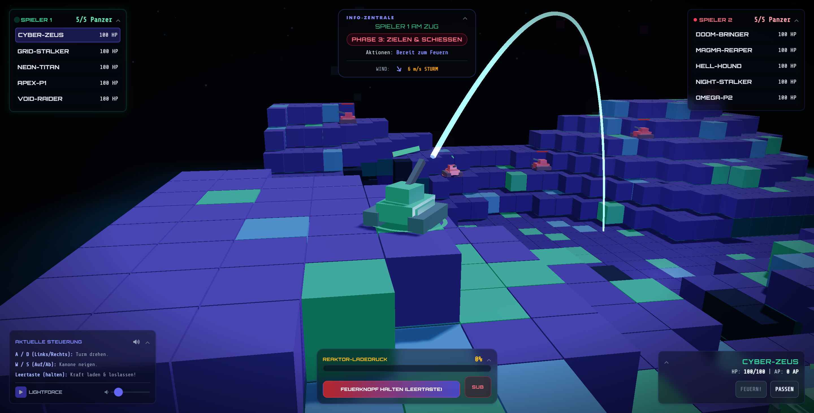
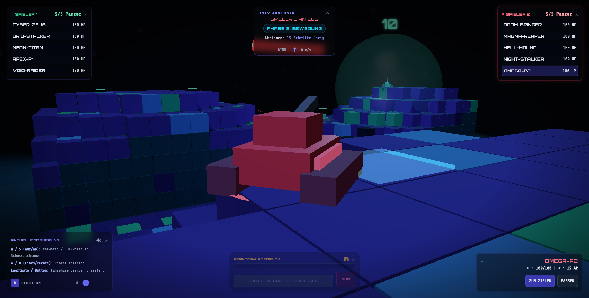
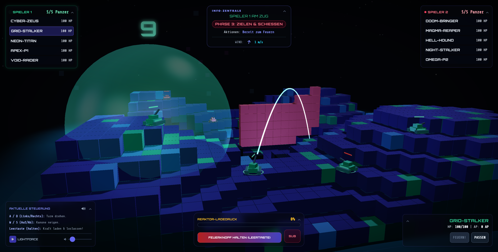

# Voxel Tank — Space Tactical Combat

<p align="center">
  
</p>

> **A browser-based 3D voxel tactics game** with destructible terrain, real-time online multiplayer, and a fully procedural synthesizer soundtrack. No installation, no downloads — runs entirely in the browser.

**[▶ Play now — https://voxel-panzer.web.app](https://voxel-panzer.web.app/)**

---

## Screenshots

<p align="center">
  
  <em>Phase 3 – Aim & Shoot: The glowing trajectory arc predicts the shell's parabolic flight path, accounting for wind drift and barrel pitch.</em>
</p>

<br/>

<p align="center">
  
  <em>Phase 2 – Movement: Drive your voxel tank across the procedurally generated battlefield, one block at a time. The S.H.I.E.L.D. dome glows in the background.</em>
</p>

<br/>

<p align="center">
  
  <em>Tactical layering: A S.H.I.E.L.D. energy dome protects a squad while a WALL barrier blocks incoming fire from the right flank — shot trajectory still arcs outward from within the dome.</em>
</p>

---

## Overview

Voxel Tank is a turn-based tactical combat game rendered entirely in the browser via WebGL (Three.js). Two players command squads of **5 tanks each** on a fully destructible voxel battlefield. Every turn is divided into three phases — select, move, shoot — and every shot permanently reshapes the terrain.

The game ships with two modes:
- **Local Hotseat** — two players share one browser tab
- **Online Multiplayer** — real-time synchronization via Firebase Realtime Database, lobby codes, and disconnect handling

No server-side game logic runs anywhere. All physics, collision, and damage calculations run client-side; the host's result is treated as authoritative and pushed to the opponent.

---

## Key Features

### Gameplay
- **3-Phase Turn Structure** — Select → Move → Aim & Shoot, each phase with distinct controls and strategy
- **15 Action Points per turn** — spend them on movement steps; unspent AP carries no bonus, so aggression is rewarded
- **Wind system** — direction and speed change each turn, affecting shell trajectory; displayed live in the HUD
- **Reactor Charge mechanic** — hold Spacebar to build muzzle velocity; releasing early fires a lobbed arc, holding to max fires a flat screamer
- **Fall damage** — tanks that lose terrain beneath them drop and take proportional damage
- **5 named tanks per player** with individual HP tracking and death animations

### Tactical Shot Modes
- **DESTROY** (Destructive) — explosive radius removes voxel blocks and deals up to 65 HP damage to nearby tanks
- **VOXEL** (Constructive) — builds a crystal hill; use it to wall in enemies, create ramps, or bridge craters
- **WALL** — spawns a 10×5 voxel barrier perpendicular to the firing direction; max 3 active walls per player
- **S.H.I.E.L.D.** — deploys a giant energy dome for 5 rounds; blocks all inbound projectiles, lets outbound shots pass freely; **once per game**

### Visuals & Audio
- **ACESFilmic tone mapping** — physically-based highlight rolloff, no blown-out whites
- **UnrealBloom post-processing** — emissive glow only on shields, particles, and trails; terrain stays clean
- **Procedural nebula skybox** — layered star fields with colored nebula clouds, generated at startup
- **Animated voxel construction** — VOXEL and WALL blocks materialize sequentially with scale/bounce animation
- **Chromatic aberration** on shot impact
- **Procedural synthesizer audio** — all music and SFX generated via the Web Audio API at runtime; zero external audio assets
- **Dynamic light flicker** during S.H.I.E.L.D. deployment affects scene-wide ambient and directional lighting
- **Impact follow-cam** — viewport smoothly lerps to the projectile impact point for a cinematic close-up on every shot
- **Screen shake** — S.H.I.E.L.D. deployment triggers a decaying camera shake (intensity 0.6, exponential decay)
- **Victory cinematic** — after the final kill the camera orbits the winning tank while its turret spins; normal gameplay is suspended until the screen clears
- **S.H.I.E.L.D. turn counter sprite** — a floating number above the dome shows exactly how many turns remain, updated each turn and removed on expiry

### Online Multiplayer
- **Lobby system** with 4-character shareable codes (e.g. `AB7X`)
- **Firebase Authentication** — play instantly as a guest, or register with email/password for persistent win/loss history
- **Real-time state sync** — tank position, turret aim, shot launches, block changes, and turn transitions via Firebase Realtime Database
- **Authoritative shooter model** — the active player computes physics and pushes definitive block/damage results; opponent's projectile is simulated locally for smooth visuals, then overwritten by the authoritative result
- **Passive spectator camera** — while the opponent takes their turn, your camera automatically shifts to a tactical drone-angle overview of the battlefield
- **Player name headers** — both players' display names appear in the squad sidebars throughout the match
- **Skip / End Turn button** — a UI button (and `Space` during movement) lets you voluntarily end your turn early; the transition is broadcast to the opponent via Firebase
- **Redundant turn-sync listener** — a secondary Firebase listener on `nextTurnTrigger` acts as a fallback to guarantee turn advancement even if the primary state listener is delayed
- **Graceful disconnect** — opponent leaving triggers automatic win declaration and match recording
- **Top 10 Leaderboard** — live ranking of registered pilots by wins, shown on the start screen after login

---

## How to Play

### Start Screen

The start screen shows three pulsing buttons over the game background:

| Button | Action |
|--------|--------|
| **LOKAL** | Start a local hotseat game immediately |
| **HELP** | Show controls and shot mode reference inline |
| **ONLINE** | Open the online multiplayer panel |

### Starting an Online Game

1. Click **ONLINE** on the start screen
2. Enter a display name and click **ALS GAST SPIELEN** (play as guest) — or register with email for a persistent profile
3. Once logged in, either:
   - **LOBBY ERSTELLEN** — creates a lobby and shows a 4-character code to share
   - Enter a friend's code and click **BEITRETEN** to join
4. When both players are in the lobby the game starts automatically

### Turn Loop

#### Phase 1 — Select
Click a tank on the battlefield or its name in the sidebar. The camera smoothly tracks to it.

#### Phase 2 — Move
| Key | Action |
|-----|--------|
| `W` / `S` | Drive forward / backward in facing direction |
| `A` / `D` | Rotate tank body left / right |
| `Space` or button | End movement, enter aiming phase |

Each step costs **1 AP**. When AP hits 0, movement ends automatically.

#### Phase 3 — Aim & Shoot
| Key | Action |
|-----|--------|
| `A` / `D` | Rotate turret left / right |
| `W` / `S` | Adjust barrel pitch up / down |
| Hold `Space` | Charge reactor (increases muzzle velocity) |
| Release `Space` | Fire |

The glowing trajectory arc updates in real time as you adjust aim. Wind is shown in the HUD — account for it on long shots.

### Shot Mode Selection
Cycle through **DESTROY / VOXEL / WALL / S.H.I.E.L.D.** using the pulsing mode button in the bottom bar before firing.

---

## Tactical Guide

### Terrain Destruction (DESTROY)
Direct impacts are satisfying, but the real power is **indirect fire**. Shoot the blocks *beneath* an enemy tank — the unit drops, takes fall damage, and loses its elevated firing position. A well-placed DESTROY shot can simultaneously expose an enemy and create a crater that limits their next movement.

### Terrain Construction (VOXEL)
VOXEL shots build terrain. Firing at an enemy's feet can **entomb** them — surrounding voxels restrict movement and block firing angles. VOXEL can also build **ramps** to reach higher ground, which grants longer effective range due to barrel elevation.

### WALL Placement
The WALL orients perpendicular to your firing direction — aim carefully to control which direction the wall runs. A well-placed wall seals a valley passage entirely, forcing enemies to climb exposed high ground. WALL blocks have **70% explosion resistance**, making them significantly harder to clear than natural terrain.

### S.H.I.E.L.D. Timing
The dome lasts exactly **5 rounds** and can only be used **once per game**. Don't deploy it reactively when one tank is low — deploy it proactively to cover a cluster of tanks while you whittle down the enemy freely. Outbound shots pass through unimpeded, so your full squad can keep firing.

---

## Technology Stack

| Layer | Technology |
|---|---|
| 3D Rendering | [Three.js](https://threejs.org/) r128 (WebGL) |
| Post-Processing | Three.js EffectComposer, UnrealBloomPass, ShaderPass |
| Camera | OrbitControls (360° battlefield inspection) |
| UI / Styling | Tailwind CSS, FontAwesome |
| Architecture | Vanilla JS — ES Modules (no bundler) |
| Audio | Web Audio API (fully procedural) |
| Backend / Multiplayer | Firebase Realtime Database |
| Authentication | Firebase Auth (anonymous guest + email/password) |
| Hosting | Firebase Hosting |

---

## Project Structure

```
├── index.html              # App shell, Tailwind, Three.js CDN imports
├── css/
│   └── style.css           # Cyberpunk neon panel styling, button animations
├── pics/
│   ├── start.jpg           # Start screen hero image
│   ├── ss1.png
│   ├── ss2.png
│   └── ss3.png
├── package.json            # npm start → npx serve .
├── start.bat               # Windows: double-click to launch local server
└── js/
    ├── constants.js        # Grid dimensions, block size, voxel color palette
    ├── state.js            # Centralized game state (tanks, phase, multiplayer)
    ├── main.js             # Three.js init, lighting, post-processing, game loop
    ├── terrain.js          # Voxel grid, procedural heightmap, instanced mesh
    ├── tank.js             # Voxel tank mesh, stats, gravity, hit flash
    ├── projectile.js       # Kinematic flight, wind drift, blast radius, block removal
    ├── particles.js        # Explosion debris, dust clouds, projectile trails
    ├── input.js            # Keyboard bindings, raycast selection, charge mechanic
    ├── ui.js               # HUD panels, turn banners, damage popups, victory screen
    ├── audio.js            # Procedural synth loops, SFX generators
    ├── multiplayer.js      # Firebase sync — lobby, state, shots, block changes
    ├── auth.js             # Firebase Auth, player profiles, match history
    └── firebase-config.js  # Firebase project credentials
```

---

## Local Development

```bash
# Clone
git clone https://github.com/enzocage/voxel-tank.git
cd voxel-tank

# Serve (ES Modules require a real HTTP server, not file://)
npm start
# or
npx serve .
# or
python -m http.server 8080
```

> **Windows users:** double-click `start.bat` — it auto-detects Python or Node and opens the browser.

Open `http://localhost:3000` (or `8080`). No build step required.

---

## Firebase Setup (for Multiplayer)

1. Create a Firebase project at [console.firebase.google.com](https://console.firebase.google.com)
2. Enable **Realtime Database** and **Authentication** (Anonymous + Email/Password providers)
3. Replace the config object in `index.html` (`window.FIREBASE_CONFIG`) with your project's credentials
4. Deploy Realtime Database rules:
```json
{
  "rules": {
    "lobbies": {
      "$lobbyId": {
        ".read": true,
        ".write": true
      }
    }
  }
}
```
5. Deploy hosting: `npx firebase-tools deploy --only hosting`

---

## Credits

**Coding:** Felix Schmidt

Built with [Three.js](https://threejs.org/), [Firebase](https://firebase.google.com/), and [Tailwind CSS](https://tailwindcss.com/).
